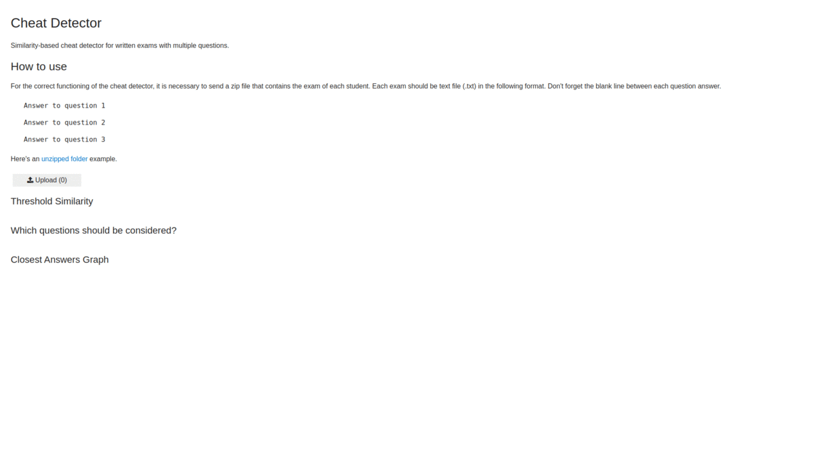
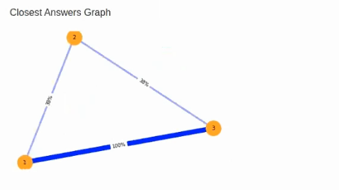

# Cheat Detector
Similarity-based cheat detector for written exams with multiple questions.

**List Number**: X<br>
**Discipline Subject**: Graphs I<br>

## Students
|Number | Student |
| -- | -- |
| 17/0146251  |  João Lucas Zarbiélli |
| 19/0046945  |  Leonardo Michalski Miranda |

## About
The cheat detector works using text similarity. The closest one student answer is to another student answer, the thicker the line that connects both students. Using our data visualization, a teacher can spend less time choosing which exams to compare side by side.


## App Gif


## Video (pt-br, [download link](https://raw.githubusercontent.com/leommiranda/Grafos1_CheatDetector/refactor/assets/cheat_detector_app_video.mp4))
[](https://youtu.be/LVv2pTIqSpo)

## How to run
**Language**: Python.<br>
**Frameworks**: SentenceTransformers; PyTorch; scikit-learn; Jupyter Voilà; BinderHub.<br>
Access the [app](https://mybinder.org/v2/gh/leommiranda/Grafos1_CheatDetector/main?urlpath=%2Fvoila%2Frender%2Fcheat_detector.ipynb) or the [notebook](https://mybinder.org/v2/gh/leommiranda/Grafos1_CheatDetector/main?filepath=cheat_detector.ipynb) with the BinderHub server.

## How to use
For the correct functioning of the cheat detector, it is necessary to send a zip file that contains the exam of each student. Each exam should be text file (.txt) in the following format. Don't forget the blank line between each question answer.

```
Answer to question 1

Answer to question 2

Answer to question 3
```

Here's an [unzipped folder](https://github.com/leommiranda/Grafos1_CheatDetector/tree/main/mock_data/prova_2) example.

## References

Jupyter et al., "Binder 2.0 - Reproducible, Interactive, Sharable
Environments for Science at Scale." Proceedings of the 17th Python
in Science Conference. 2018. doi://10.25080/Majora-4af1f417-011

Nils Reimers and Iryna Gurevych. 2019. [SentenceBERT: Sentence
embeddings using Siamese BERT-networks.](http://arxiv.org/abs/1908.10084)
In Proceedings of the 2019 Conference on Empirical Methods in Natural
Language Processing and the 9th International Joint Conference on Natural
Language Processing (EMNLP-IJCNLP), pages 3982–3992, Hong Kong, China.
Association for Computational Linguistics.

Reimers, N.; and Gurevych, I. 2020. Making Monolingual Sentence Embeddings
Multilingual using Knowledge Distillation. arXiv preprint arXiv:2004.09813
[URL](http://arxiv.org/abs/2004.09813).
